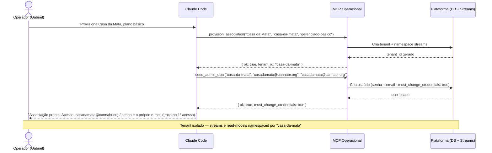
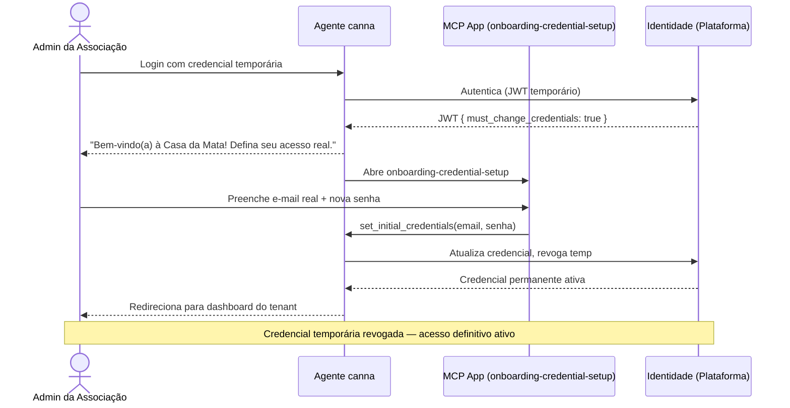
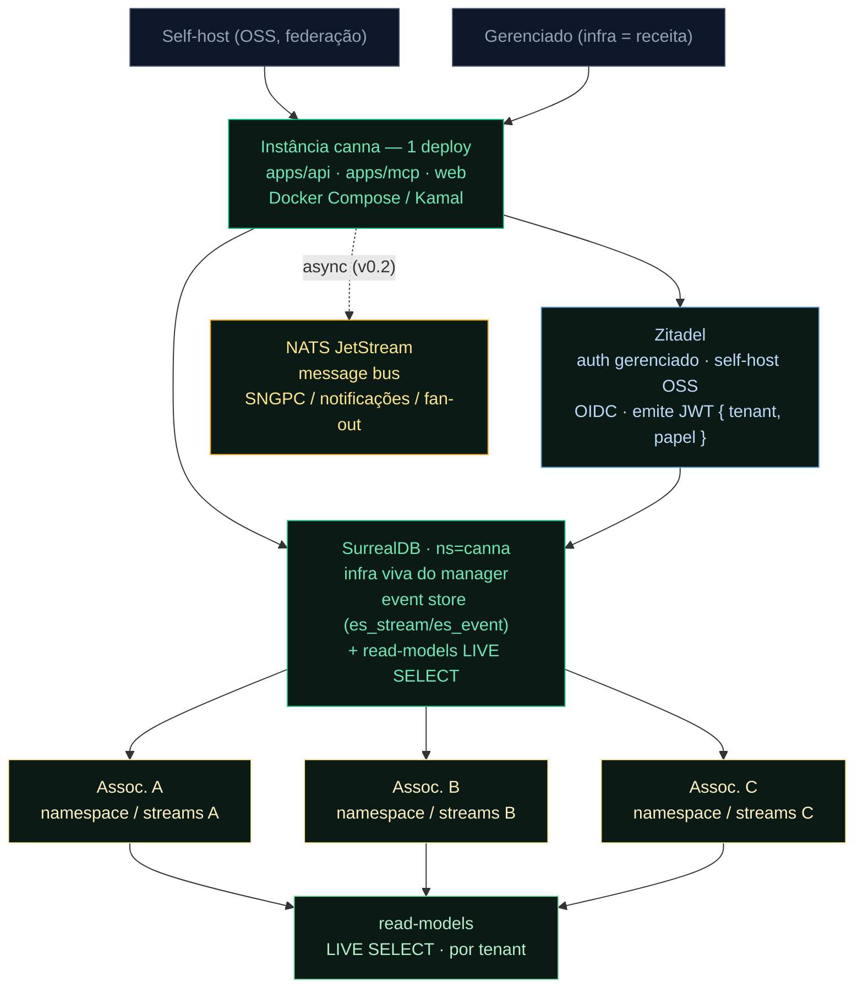
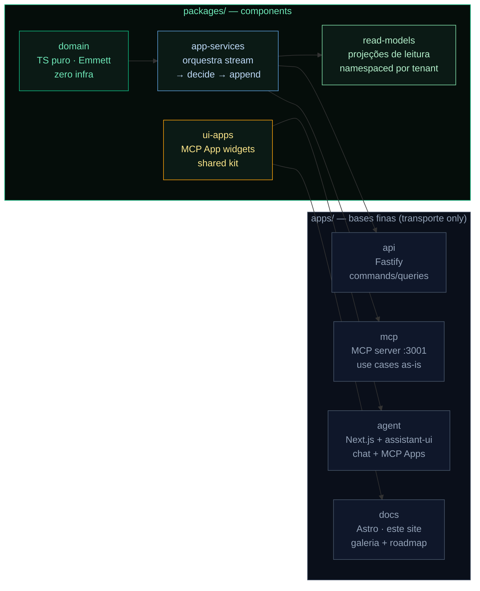
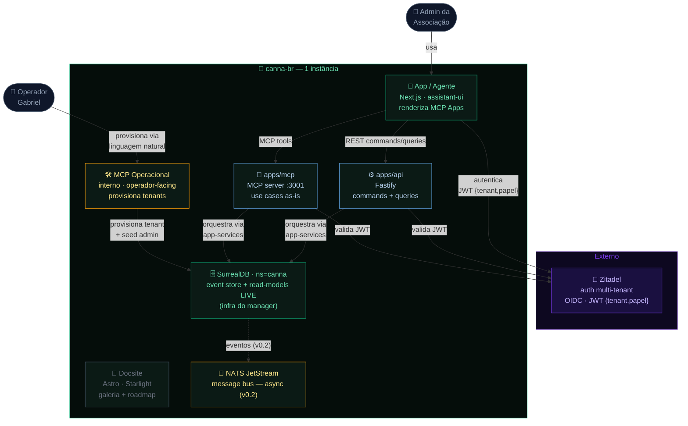

import EventStormingBoard from '../../../components/EventStormingBoard.astro';
import UseCaseMatrix from '../../../components/UseCaseMatrix.astro';
import InviteReturnContract from '../../../components/InviteReturnContract.astro';

:::caution[Draft — desenhando juntos]
Estrutura em construção. Diagrama de arquitetura como Mermaid; EventStorming já modelado abaixo.
:::

:::note[Numeração atual do roadmap]
Sob a numeração atual, **v0.1.0 = o sistema usável que já roda** (cadastro/gestão de membros, dispensação com aprovação, rastreabilidade de lote, trilha de auditoria imutável, cotas por prescrição, criptografia por membro LGPD, MCP server inline, 154/154 testes, live em cannabr.org). O slice de **multi-tenant + onboarding self-serve** detalhado nesta página é o **v0.2**.
:::

A parte que vamos analisar nesta versão: o **onboarding da associação** + a **autenticação multi-tenant**. Modelado como EventStorming antes de codar.

<EventStormingBoard
  title="Onboarding + Auth Multi-tenant — EventStorming v0.1.0"
  columns={[
    {
      cards: [
        { type: 'actor',     label: 'Operador da plataforma' },
        { type: 'command',   label: 'Provisionar Associação' },
        { type: 'aggregate', label: 'Associação (Tenant)' },
        { type: 'event',     label: 'Associação Provisionada', pivotal: true },
      ]
    },
    {
      cards: [
        { type: 'policy',    label: 'Ao provisionar → semear admin' },
        { type: 'command',   label: 'Semear Usuário Admin (cred. temp · senha=email)' },
        { type: 'aggregate', label: 'Identidade' },
        { type: 'event',     label: 'Admin Semeado · must_change_credentials' },
      ]
    },
    {
      cards: [
        { type: 'actor',      label: 'Admin da Associação' },
        { type: 'read-model', label: 'Página de Login' },
        { type: 'command',    label: 'Autenticar' },
        { type: 'aggregate',  label: 'Sessão' },
        { type: 'event',      label: 'Usuário Autenticado', pivotal: true },
        { type: 'policy',     label: 'Emitir JWT { tenant, papel, must_change_credentials }' },
      ]
    },
    {
      cards: [
        { type: 'policy',     label: 'Se must_change_credentials → abrir onboarding no agente' },
        { type: 'read-model', label: 'MCP App: onboarding-credential-setup' },
        { type: 'command',    label: 'Definir Acesso Real (e-mail + senha)' },
        { type: 'aggregate',  label: 'Identidade' },
        { type: 'event',      label: 'Credenciais Definidas · Cred. Temp Revogada', pivotal: true },
      ]
    },
    {
      cards: [
        { type: 'read-model', label: 'Dashboard do Tenant (escopado)' },
        { type: 'actor',      label: 'Admin' },
        { type: 'command',    label: 'Cadastrar Membro' },
        { type: 'aggregate',  label: 'Membership' },
        { type: 'event',      label: 'Membro Cadastrado' },
        { type: 'read-model', label: 'Lista de Membros (do tenant)' },
      ]
    },
  ]}
  hotspots={[
    { label: 'Como isolar event streams por tenant?' },
    { label: 'SSO / convite de usuário entram na v0.1?' },
  ]}
/>

## Operador: liberar uma associação (MCP Operacional interno)

O operador (Gabriel) nunca abre um formulário de cadastro. Em vez disso, abre o Claude Code e conversa com o **MCP Operacional** — um servidor MCP interno, separado do `apps/mcp` que as associações usam. Em segundos, o tenant está provisionado e a credencial inicial entregue. Não há tela de signup, não há fluxo manual: o operador descreve o que quer em linguagem natural e o MCP executa as primitivas abaixo.

### Ferramentas do MCP Operacional (esboço)

| Tool | O que faz | Nível |
|---|---|---|
| `provision_association(nome, slug, plano)` | Cria tenant isolado + namespace de streams + plano de acesso | Operador |
| `seed_admin_user(associação, email, senha_temporária)` | Cria o primeiro usuário admin com flag `must_change_credentials` | Operador |
| `list_associations()` | Lista todos os tenants ativos com status e plano | Operador (leitura) |
| `suspend_association(id)` | Pausa acesso ao tenant (mantém dados) | Operador |
| `reset_credential(user)` | Força novo `must_change_credentials` num usuário existente | Operador |

### Exemplo concreto

O operador quer libertar a "Casa da Mata". Dois comandos no Claude Code:

```
provision_association("Casa da Mata", "casa-da-mata", "gerenciado-basico")
seed_admin_user("casa-da-mata", "casadamata@cannabr.org", "casadamata@cannabr.org")
```

O MCP provisiona o tenant e cria o usuário admin com a credencial temporária no padrão **senha = e-mail** (`casadamata@cannabr.org` / `casadamata@cannabr.org`) — simples de repassar, válida **só para o primeiro acesso** e com troca obrigatória (`must_change_credentials`). A associação recebe esse acesso e o muda na primeira entrada.

### Sequência de provisionamento



## Primeiro acesso: onboarding no agente

Quando o admin da associação usa pela primeira vez a credencial temporária entregue pelo operador, o agente detecta automaticamente o flag `must_change_credentials` no JWT. Em vez de bloquear o acesso com uma mensagem de erro, o agente saúda o usuário pelo nome da associação, explica o contexto em linguagem natural e abre um **MCP App** diretamente na conversa — o `onboarding-credential-setup` — onde o usuário define e-mail real e senha permanente antes de qualquer outra ação. Após a confirmação, a credencial temporária é revogada, o JWT é reemitido com o novo acesso e o usuário segue direto para o dashboard do tenant.

<p style="font-size:0.8125rem;color:var(--sl-color-text-accent);margin-bottom:0.5rem;font-style:italic">Esboço do MCP App de primeiro acesso</p>

<iframe data-app src="/apps/onboarding-credential-setup.html" title="MCP App — Configuração de Credenciais (Primeiro Acesso)" loading="lazy" sandbox="allow-scripts allow-same-origin" style="width:100%;height:520px;border:1px solid var(--sl-color-gray-5);border-radius:12px;background:transparent;display:block"></iframe>
<script src="/apps/_resize.js" is:inline></script>

App ao vivo com dados de exemplo — é o widget real que o agente abre no primeiro acesso. No produto, o `set_initial_credentials` substitui o acesso temporário pelo definitivo.

### Sequência de primeiro acesso

1. **Agente detecta `must_change_credentials`** — lê o claim no JWT logo após a autenticação inicial com senha temporária.
2. **Abre `onboarding-credential-setup`** — o MCP App aparece na interface; o usuário define e-mail real e senha permanente (mínimo 8 chars, troca obrigatória confirmada).
3. **`set_initial_credentials` executado** — credencial temporária revogada, JWT reemitido com acesso normal, usuário redirecionado ao dashboard do tenant.



## Cadastro de membro: chat → form preenchido → confirma

A melhor UX combina **velocidade do chat** + **confiança do formulário**. O usuário escreve em linguagem natural — o agente extrai os campos e abre o **MCP App de cadastro já preenchido**. O usuário revisa e confirma (ou corrige). NL para velocidade; form para revisão, validação e confiança antes de gravar.

<div class="member-reg-demo">
  <div class="member-reg-chat">
    <div class="mrc-bubble mrc-bubble--user">
      <span class="mrc-avatar mrc-avatar--user" aria-hidden="true">U</span>
      <div class="mrc-content">
        Cadastrar <strong>Fulano de Tal</strong>, CPF 123.456.789-00, nascido em 12/04/1989, contato fulano@email.com, papel: associado.
      </div>
    </div>
    <div class="mrc-bubble mrc-bubble--agent">
      <span class="mrc-avatar mrc-avatar--agent" aria-hidden="true">◆</span>
      <div class="mrc-content">
        Extraí os dados — confira e confirme:
      </div>
    </div>
  </div>
  <div class="member-reg-app">
    <iframe
      data-app
      src="/apps/member-registration.html"
      title="MCP App — Cadastro de Membro (form pré-preenchido)"
      loading="lazy"
      sandbox="allow-scripts allow-same-origin"
      style="width:100%;height:520px;border:none;border-radius:0 0 10px 10px;background:transparent;display:block"
    ></iframe>
  </div>
</div>
<script src="/apps/_resize.js" is:inline></script>

<p class="member-reg-caption">App ao vivo — o form aparece preenchido pelo que o agente extraiu; o usuário revisa e confirma (<code>register_member</code>). Bate o melhor dos dois mundos: sem redigitar (NL ≠ form blind-write) e sem esconder o dado num chat (form = revisão estruturada antes de gravar).</p>

<style>{`
  .member-reg-demo {
    border: 1px solid rgba(16, 185, 129, 0.22);
    border-radius: 12px;
    overflow: hidden;
    background: #0b1a15;
    margin: 1rem 0 0.5rem;
  }
  .member-reg-chat {
    padding: 14px 16px 10px;
    display: flex;
    flex-direction: column;
    gap: 10px;
    border-bottom: 1px solid rgba(16, 185, 129, 0.14);
  }
  .mrc-bubble {
    display: flex;
    align-items: flex-start;
    gap: 10px;
  }
  .mrc-avatar {
    flex-shrink: 0;
    width: 26px;
    height: 26px;
    border-radius: 50%;
    display: flex;
    align-items: center;
    justify-content: center;
    font-size: 0.6875rem;
    font-weight: 700;
    line-height: 1;
  }
  .mrc-avatar--user {
    background: rgba(91, 155, 213, 0.20);
    border: 1px solid rgba(91, 155, 213, 0.35);
    color: #bdd9f7;
  }
  .mrc-avatar--agent {
    background: rgba(16, 185, 129, 0.18);
    border: 1px solid rgba(16, 185, 129, 0.35);
    color: #6ee7b7;
    font-size: 0.75rem;
  }
  .mrc-content {
    font-size: 0.8125rem;
    line-height: 1.5;
    color: rgba(255,255,255,0.82);
    padding: 6px 12px;
    border-radius: 0 8px 8px 8px;
  }
  .mrc-bubble--user .mrc-content {
    background: rgba(91, 155, 213, 0.10);
    border: 1px solid rgba(91, 155, 213, 0.18);
  }
  .mrc-bubble--agent .mrc-content {
    background: rgba(16, 185, 129, 0.08);
    border: 1px solid rgba(16, 185, 129, 0.16);
    color: rgba(255,255,255,0.70);
  }
  .member-reg-caption {
    font-size: 0.75rem;
    color: rgba(255, 255, 255, 0.45);
    margin-top: 8px;
    margin-bottom: 1.5rem;
    line-height: 1.5;
  }
  .member-reg-caption code {
    font-family: var(--sl-font-mono, 'JetBrains Mono', ui-monospace, monospace);
    font-size: 0.6875rem;
    background: rgba(16, 185, 129, 0.10) !important;
    color: #6ee7b7 !important;
    border: 1px solid rgba(16, 185, 129, 0.2) !important;
    padding: 0.1rem 0.3rem !important;
    border-radius: 4px !important;
  }
  @media (max-width: 480px) {
    .member-reg-chat { padding: 10px 12px 8px; gap: 8px; }
    .mrc-content { font-size: 0.75rem; padding: 5px 10px; }
  }
`}</style>

## O retorno é o convite — a última milha

O operador vive no chat do Claude Code. Toda use case da camada de aplicação devolve o **entregável humano pronto** (a mensagem, o link, o recibo), não só o registro/ID — o operador cola e segue. Esse é o detalhe de UX agent-first que fecha o loop.

### Exemplo: convite gerado pelo MCP Operacional

<InviteReturnContract />

### Pattern: o retorno é o artefato acionável

Cada linha abaixo mapeia um use case ao artefato que o operador ou membro realmente precisa — não o `id` ou `ok`, mas o texto, link ou recibo pronto pra usar.

## Camada de Aplicação

<UseCaseMatrix groups={[
  {
    context: "Onboarding & Identidade (v0.1.0)",
    useCases: [
      {
        name: "provisionAssociation",
        type: "command",
        desc: "Cria uma nova associação (tenant) isolada na instância.",
        surfaces: { mcp: "provision_association" }
      },
      {
        name: "seedAdminUser",
        type: "command",
        desc: "Semeia o primeiro admin com credencial temporária (troca obrigatória).",
        surfaces: { mcp: "seed_admin_user" }
      },
      {
        name: "listAssociations",
        type: "query",
        desc: "Lista os tenants ativos com status e plano.",
        surfaces: { mcp: "list_associations", app: true }
      },
      {
        name: "authenticate",
        type: "command",
        desc: "Autentica o usuário e emite o JWT com tenant + papel. via Zitadel (OIDC) — claims tenant+papel no JWT.",
        surfaces: { web: "Zitadel (managed auth)" }
      },
      {
        name: "setInitialCredentials",
        type: "command",
        desc: "Troca a credencial temporária pelo acesso real no 1º login.",
        surfaces: { mcp: "set_initial_credentials", app: "onboarding-credential-setup" }
      },
      {
        name: "resetCredential",
        type: "command",
        desc: "Força novo must_change_credentials num usuário existente.",
        surfaces: { mcp: "reset_credential" }
      },
    ]
  },
  {
    context: "Membership mínima (v0.1.0)",
    useCases: [
      {
        name: "registerMember",
        type: "command",
        desc: "Cadastra um novo associado no tenant (identidade: nome, CPF, contato, papel).",
        surfaces: { mcp: "register_member", app: "member-registration" }
      },
      {
        name: "getMember",
        type: "query",
        desc: "Carrega os dados de identidade de um associado do tenant.",
        surfaces: { mcp: "get_member", app: true }
      },
      {
        name: "listMembers",
        type: "query",
        desc: "Lista os membros do tenant por status (ciclo de vida).",
        surfaces: { mcp: "list_members", app: "MemberLifecycleBoard" }
      },
      {
        name: "viewMemberQuota",
        type: "query",
        desc: "Visualiza a cota do membro (somente leitura — a escrita da cota entra na v0.2).",
        surfaces: { mcp: "get_member_quota", app: "MemberQuotaCard" }
      },
    ]
  },
  {
    context: "Próximas versões (v0.2+) — fora do escopo de v0.1.0",
    useCases: [
      {
        name: "validatePrescription",
        type: "command",
        desc: "v0.2 · Valida a prescrição e escreve a cota mensal do membro.",
        surfaces: { mcp: "validate_prescription", app: true }
      },
      {
        name: "grantConsent",
        type: "command",
        desc: "v0.2 · Registra o consentimento LGPD do associado.",
        surfaces: { mcp: "grant_consent" }
      },
      {
        name: "revokeConsent",
        type: "command",
        desc: "v0.2 · Revoga o consentimento (gatilho de anonimização).",
        surfaces: { mcp: "revoke_consent" }
      },
      {
        name: "anonymizeMember",
        type: "command",
        desc: "v0.2 · Apaga dados pessoais via crypto-deletion (LGPD Art. 18).",
        surfaces: { mcp: "anonymize_member" }
      },
      {
        name: "createLot",
        type: "command",
        desc: "v0.2 · Cria um lote em quarentena (Inventory).",
        surfaces: { mcp: "create_lot" }
      },
      {
        name: "releaseLot",
        type: "command",
        desc: "v0.2 · Libera um lote aprovado para dispensação (Inventory).",
        surfaces: { mcp: "release_lot", app: true }
      },
      {
        name: "recallLot",
        type: "command",
        desc: "v0.2 · Recolhe um lote (contaminação / qualidade) (Inventory).",
        surfaces: { mcp: "recall_lot" }
      },
      {
        name: "recordDispensation",
        type: "command",
        desc: "v0.2 · Registra dispensação (dispensa + cota + lote) (Dispensation).",
        surfaces: { mcp: "record_dispensation", app: "DispensationForm" }
      },
      {
        name: "submitSngpc",
        type: "command",
        desc: "v0.2 · Submete o relatório SNGPC à ANVISA (consumidor assíncrono via NATS).",
        surfaces: { mcp: "submit_sngpc" }
      },
      {
        name: "suspendMember",
        type: "command",
        desc: "v0.2 · Suspende temporariamente um associado (bloqueia dispensações sem excluir dados).",
        surfaces: { mcp: "suspend_member" }
      },
      {
        name: "reinstateMember",
        type: "command",
        desc: "v0.2 · Reintegra um associado suspenso, restaurando acesso às dispensações.",
        surfaces: { mcp: "reinstate_member" }
      },
      {
        name: "quarantineLot",
        type: "command",
        desc: "v0.2 · Coloca um lote em quarentena preventiva pendente de análise de qualidade.",
        surfaces: { mcp: "quarantine_lot" }
      },
      {
        name: "loadLotState",
        type: "query",
        desc: "v0.2 · Carrega o estado atual de um lote (quarentena, liberado, recolhido, esgotado).",
        surfaces: { mcp: "get_lot_state", app: true }
      },
      {
        name: "loadAssociationDispensations",
        type: "query",
        desc: "v0.2 · Lista todas as dispensações da associação com filtros de período e membro.",
        surfaces: { mcp: "list_association_dispensations", app: "DispensationBoard" }
      },
    ]
  },
]} />

## A fatia usável

> **Tese:** v0.1.0 é a menor versão que **já se usa**: sobe-se uma instância canna (self-hostada ou gerenciada), uma **associação faz onboarding**, seus usuários **entram por um login multi-tenant** e fazem **algumas operações básicas**. É a fundação do produto — não o tronco regulatório completo (esse entra nos minors seguintes).

**O valor vem dos minors.** Cada minor entrega algo que alguém **usa**. O domain kernel + event store (o que chamávamos "v0.1 Blueprint" / "v0.2 Kernel") são **fundações pré-0.1** — alicerce de código, não valor de usuário. A numeração reflete **valor entregue**.

**Por que isso é a fatia usável e não o spine de dispensação?** Porque sem **porta de entrada** — instância no ar, associação cadastrada, login que isola dados por tenant — não há nada pra *usar*. Dispensação sem onboarding + auth + multi-tenant é uma demo, não um produto. v0.1.0 entrega a porta; v0.2+ entrega o tronco regulatório por trás dela.

**O momento usável** (o que dá pra demonstrar no fim de v0.1.0):

> Um operador sobe a instância (Docker Compose / Kamal). Cria a associação no **onboarding**. Um usuário da associação **faz login** (multi-tenant, dados isolados). Dentro, cadastra alguns **membros** e vê um **painel** escopado só à sua associação. Outra associação na mesma instância **não enxerga** nada disso.

## Self-hosting & multi-tenant (o modelo)

A pergunta que v0.1.0 responde: **como se vende e se entrega isso?**

| Modo | Quem | Receita | v0.1.0 entrega |
|---|---|---|---|
| **Gerenciado (multi-tenant)** | Plataforma hospeda N associações numa instância | **Infra = receita** (tese infraeconomics) | Login multi-tenant + isolamento por tenant + onboarding |
| **Self-host (OSS)** | Federação/associação roda a própria instância | Comunidade / licença comercial p/ embed | Mesmo binário, deploy Docker/Kamal documentado |

O **trabalho concreto** de v0.1.0 é a **página de login multi-tenant** + o isolamento de dados por associação (tenant). Mesmo código serve os dois modos — só muda quem opera o deploy. Isso ancora o GTM: o produto é vendável (gerenciado) **e** aberto (self-host) desde a v0.1.0.

## Arquitetura inicial (v0.1.0)



Isolamento: cada request carrega o tenant (claim no JWT → header `x-canna-association`); cada associação é um **namespace SurrealDB** próprio — event streams e read-models nunca cruzam. Read-models fazem push pra UI via `LIVE SELECT` (sem bus em v0.1). O **NATS JetStream** entra só em v0.2, quando aparece consumidor assíncrono (SNGPC, notificações, fan-out entre instâncias).

### Por que Zitadel

**Velocidade primeiro, infra gerenciada.** A oferta gerenciada roda em **Zitadel Cloud · OIDC/PKCE · região EU · free tier** — multi-tenant nativo com organizações isoladas, e JWT que já carrega `org_id` + roles — exatamente os claims `{ tenant, papel }` que o canna precisa sem camada de transformação. O app user-facing autentica via **PKCE** (fluxo OIDC público, sem secret no cliente). O mesmo binário é OSS (AGPL) e self-hostável: quem preferir soberania total instala a própria instância sem mudar uma linha de código da aplicação.

### Por que SurrealDB + NATS JetStream

**Database agêntico, infra já viva.** O event store de v0.1.0 é **SurrealDB** (`ns=canna`) — rodando na **mesma instância do manager** (VPS interna), zero infra nova pra provisionar. É um engine multi-model que colapsa a stack: document + grafo (cadeia de custódia Membro→Lote→Dispensação) + vetor (RAG sobre RDC/ANVISA pro agente) + `CHANGEFEED` (trilha imutável LGPD art. 37) + `LIVE SELECT` (read-models fazem push, sem bus) — num só processo. O pattern `es_stream`/`es_event` com optimistic concurrency **já está provado** (o manager roda isso hoje). O domínio fica intacto atrás do port `CannaEventStore` — Postgres/Emmett continua sendo o caminho **self-host** (dual model).

**O bus chega quando precisa.** O **NATS JetStream** (também vivo) é o *message bus* — distribui eventos pra consumidores assíncronos. Em v0.1.0 não há consumidor async (cadastrar membro + ver painel é síncrono via `LIVE SELECT`), então o bus **não entra ainda**. Ele aparece em **v0.2**: submissão SNGPC assíncrona, notificações, políticas cross-context, fan-out entre instâncias/federação. Distinção que importa: **event store** (SurrealDB, verdade append-only por stream) ≠ **message bus** (NATS, distribuição). Ver [ADR-003](/adr/0003-stack-pivot-nats-surreal-dbos/).

## Arquitetura: app fino, domínio isolado (polylith)

O canna segue o padrão **polylith**: o código de negócio vive em `packages/` (components reutilizáveis), e as aplicações em `apps/` são bases finas que apenas compõem esses components. Nenhuma regra de domínio vive numa base.

**Domínio isolado.** `packages/domain` é TypeScript puro, event-sourced via [Emmett](https://event-driven-io.github.io/emmett/), sem nenhuma dependência de infra, HTTP ou driver de banco. Todas as invariantes e regras de negócio vivem exclusivamente aqui.

**Use cases como orquestração.** `packages/app-services` orquestra: carrega o stream de eventos → decide (via domain) → faz append. É a camada que o MCP expõe diretamente, 1 use case = 1 tool.

**Bases finas.** `apps/api` (Fastify), `apps/mcp` (MCP server :3001), `apps/agent` (Next.js + assistant-ui) e `apps/docs` (este docsite) são camadas de transporte. Compõem os components; não contêm regra de negócio.

**MCP App widgets compartilhados.** O kit `packages/ui-apps` (widgets MCP App) é renderizado em dois lugares ao mesmo tempo: na **galeria do docsite** (aprovação/preview por Gabriel) e no **app do produto** (agente abre o widget na conversa). Mesmo artefato, duas superfícies — como o princípio "App is a Tool" exige.



O domínio é o núcleo imutável. As bases trocam (Fastify por Hono, Next por Remix) sem mexer em uma linha de regra. Os widgets viajam entre superfícies sem duplicação.

## C4 — v0.1.0

Visão de containers da versão inicial: um operador, N admins de associação, e o que roda dentro de uma instância canna.



Tenants são isolados por **namespace SurrealDB** — `casa-da-mata` nunca cruza com `outra-assoc`. Read-models fazem push via `LIVE SELECT`; o NATS JetStream (bus) só entra em v0.2 pra consumidor assíncrono. O Zitadel é o único ponto de autenticação; a aplicação não armazena senhas.

## Escopo & Done-when

**Dentro de v0.1.0:**

| Capability | Valor | Done-when |
|---|---|---|
| Onboarding de associação | Cria o tenant + primeiro admin | Form/fluxo que provisiona uma associação nova e seu usuário admin |
| Login multi-tenant | Porta de entrada isolada por tenant | Página de login → JWT com `{ tenant, role }`; TOTP opcional |
| Isolamento por tenant | Dado de uma associação invisível pra outra | Streams + read-models namespaced; teste cross-tenant nega acesso |
| Operações básicas | Algo pra fazer logo de cara | Cadastrar membro + ver painel escopado ao tenant |
| Deploy documentado (2 modos) | Vendável + self-hostável | Docker Compose / Kamal + doc "suba a sua instância" |

**Fora de v0.1.0** (próximos minors):

- Tronco regulatório completo (prescrição → cota → lote → **dispensação c/ aprovação RT** → SNGPC) → **v0.2**
- Cultivo / processamento / laboratório → futuro
- Financeiro / DRE → futuro
- Federação entre instâncias → futuro

**Done-when (aceite da versão):**

> Numa instância recém-subida, duas associações fazem onboarding, cada uma loga no seu tenant, cadastra membros e vê só os seus dados. Nenhum vazamento entre tenants. Documentado para self-host **e** gerenciado.
