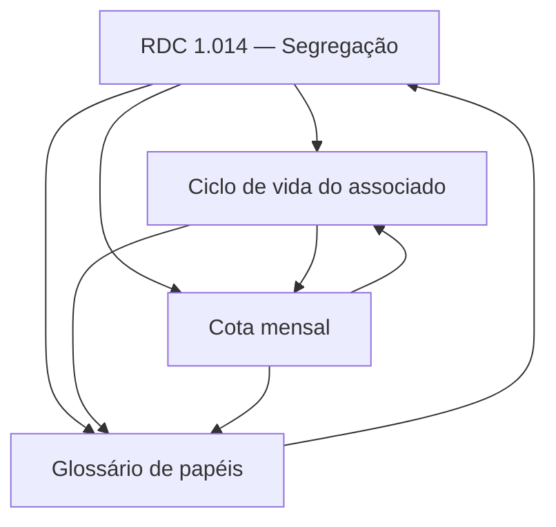

# canna-br — Conhecimento de domínio

Bundle OKF de conhecimento de domínio que o agente consome para operar a gestão de associação canábica (RDC 1.014, LGPD). Todo conteúdo foi confirmado contra `packages/domain/` e `apps/mcp/src/tools/` — cada regra cita `file:line`.

## Conceitos

- [RDC 1.014 — Segregação de função](rdc-1014-segregation.md) — `rule` — solicitante ≠ aprovador; cota só consome no approve.
- [Ciclo de vida do associado](member-lifecycle.md) — `playbook` — estados e transições do membro + tool de cada transição.
- [Cota mensal](monthly-quota.md) — `playbook` — `validate_prescription` crava a cota; dispensação aprovada deduz `consumed_g`.
- [Glossário de papéis e RBAC](roles-glossary.md) — `glossary` — DISPENSADOR/RT/DIRETORIA/DPO/AUDITOR e o que cada um pode.

## Grafo dos conceitos

O fluxo de leitura recomendado: **Papéis** (quem) → **Ciclo de vida** (em que estado) → **RDC 1.014** (como dispensa) → **Cota mensal** (quanto).
